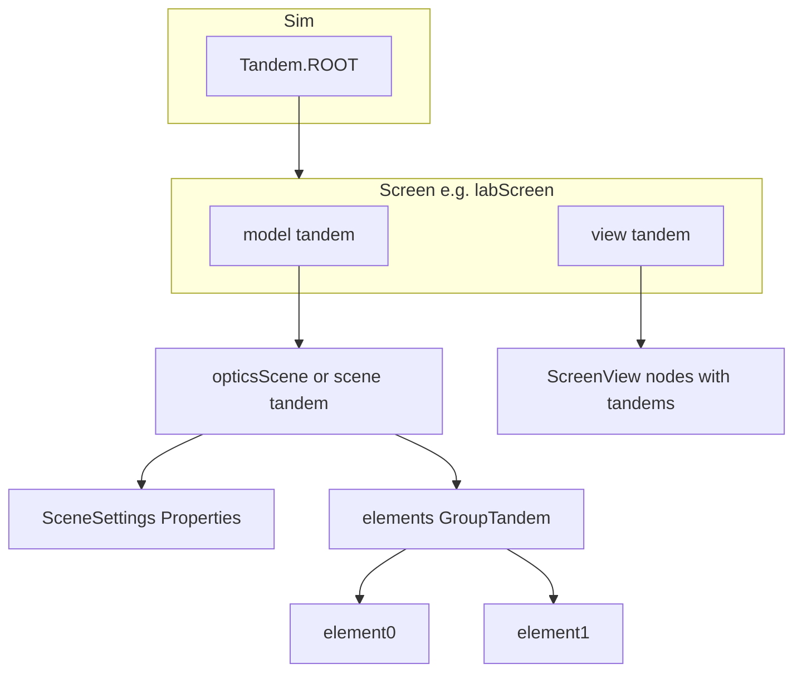

# Plan: PhET-iO–style tandem instrumentation for OpticsLab

This document summarizes how [circuit-construction-kit-common](https://github.com/phetsims/circuit-construction-kit-common) (CCK) uses **Tandem** and related **PhET-iO** patterns, compares that to the current **OpticsLab** codebase (SceneryStack / `scenerystack`), and outlines a phased plan to deepen instrumentation.

**References**

- CCK shared library: [phetsims/circuit-construction-kit-common](https://github.com/phetsims/circuit-construction-kit-common) (GPL-3.0). Use it as a **pattern reference**; do not copy proprietary PhET build glue unless license and tooling align.
- Tandem concepts in SceneryStack: [Tandem API](https://scenerystack.org/reference/api/tandem/Tandem/), [PhetioObject](https://scenerystack.org/reference/api/tandem/PhetioObject/).
- PhET source for `Tandem`: [phetsims/tandem](https://github.com/phetsims/tandem/blob/main/js/Tandem.ts).

---

## 1. What “phet-io / tandem” means in practice

- **Tandem** is a hierarchical naming tree (`sim.screen.model.foo.bar`). Each node can parent **PhetioObjects** (e.g. Axon `Property`, Scenery `Node`, `Emitter`, grouped dynamic instances).
- **PhET-iO** is the runtime + API that exposes those objects to wrappers (studio, data stream, state). In SceneryStack, full PhET-iO behavior is tied to the **phet-io brand / build**; tandems still establish stable IDs and registration for when that layer is active.
- **Patterns to mirror from CCK** (see `CircuitConstructionKitModel.ts` in the repo):
  - Pass **`tandem`** into the top-level model and **subdivide** with `createTandem('circuit')`, `createTandem('meters')`, etc.
  - Instrument **user-facing state** with Axon `*Property` types and `{ tandem: tandem.createTandem('name') }` (often with `phetioFeatured`, `phetioDocumentation` where the stack supports it).
  - Use **conditional tandems**: `condition ? tandem.createTandem('x') : Tandem.OPT_OUT` for features that exist only in some screens/variants.
  - For **dynamic collections** (vertices, circuit elements), use **group tandems** (`createGroupTandem`) so each new instance gets a stable indexed id (CCK’s circuit does this via grouped model elements).
  - Emit **coarse-grained events** for wrappers (CCK’s `circuitChangedEmitter`) when many low-level fields change, so clients can refresh state without subscribing to every wire.
  - Respect **state setting**: PhET uses `isSettingPhetioStateProperty` to avoid side effects during restore; OpticsLab should apply the same idea when linking properties to scene rebuilds.

---

## 2. Current state in OpticsLab (brief audit)

**Already in good shape**

- Screens receive `tandem: Tandem.ROOT.createTandem('…Screen')` in [`src/main.ts`](../src/main.ts).
- Screen → model/view split: `options.tandem.createTandem('model' | 'view')` in Intro/Lab/Presets/Diffraction screen classes.
- [`OpticsLabPreferencesModel`](../src/preferences/OpticsLabPreferencesModel.ts) and [`OpticsLabPreferencesNode`](../src/preferences/OpticsLabPreferencesNode.ts) pass tandems into properties and some controls.
- [`RayTracingCommonView`](../src/common/view/SimScreenView.ts) uses tandems for layers like `elementsLayer` and `resetAllButton` when a view tandem is supplied; many internal controls intentionally use `Tandem.OPT_OUT`.

**Gaps (main work)**

| Area | Issue |
|------|--------|
| [`RayTracingCommonModel`](../src/common/model/SimModel.ts) | Holds `tandem` but **`OpticsScene` is constructed with no tandem**; nothing under `model` is registered from the scene. |
| [`OpticsScene`](../src/common/model/optics/OpticsScene.ts) | Settings are a **plain mutable object** (`SceneSettings`), not instrumented `Property` instances—no PhET-iO surface for mode, ray density, grid, etc. |
| Dynamic elements | **`OpticalElement`** instances are added/removed without group tandems or PhetioObject registration. |
| [`PresetsModel`](../src/presets/PresetsModel.ts) | `selectedPresetProperty` has **no tandem**; preset changes are invisible to instrumentation. |
| Edit / carousel UI | Widespread **`Tandem.OPT_OUT`** in edit controls and helpers—appropriate for a first pass, but limits studio/wrapper control. |
| Serialization | Scene has **`toJSON` / `fromJSON`**; PhET-iO **state API** needs explicit **IO types** (`phetioType` / `phetioValueType`) wherever inference is wrong or state must round-trip—see **§2.1** below. |

---

## 2.1 Explicit PhET-iO types — what to do (concrete)

PhET-iO does not only need a **tandem id**; each instrumented object has a **`phetioType`** ([`IOType`](https://scenerystack.org/reference/api/tandem/IOType/) / `AnyIOType` in SceneryStack) that defines **serialization**, **wrapper methods**, and **data-stream events**. See [`PhetioObject` options](https://scenerystack.org/reference/api/tandem/PhetioObject/) (`phetioType`, `phetioEventType`, etc.) and PhET source [`PhetioObject.ts`](https://github.com/phetsims/tandem/blob/main/js/PhetioObject.ts).

### A. Defaults vs explicit types

- Many SceneryStack / Axon types **infer** a suitable IO type from the runtime value (e.g. `BooleanProperty` → boolean IO).
- You must supply an **explicit** type when:
  - **Inference is ambiguous or wrong** (e.g. numbers that must be **integers**, constrained ranges, or not serialized as raw floats).
  - The value is a **`DerivedProperty`** or other computed channel: set **`phetioValueType`** to the IO type of the *public* value (CCK example: `zoomScaleProperty` uses `NumberIO` on a `DerivedProperty`).
  - The value is an **enumeration** / string union: use the stack’s **enumeration IO** (PhET: `EnumerationIO`, `EnumerationProperty` + tandem)—do not rely on generic string serialization unless you accept a looser API.
  - The object is **composite** (optical element, whole scene): default `Object` serialization may be missing, unstable, or too wide—you define a **custom `IOType`** or expose a **narrower** surface (see §2.1.D).

### B. Primitive and built-in IO types (typical imports)

Verify exact import paths in your **`scenerystack`** version (often under `scenerystack/tandem` or tandem re-exports). Patterns from PhET/CCK:

| Kind | Typical IO type | Use in OpticsLab |
|------|-------------------|------------------|
| Boolean toggles | Boolean IO | `showGrid`, `snapToGrid`, preference flags |
| Scalar float | Number IO + `numberType: 'FloatingPoint'` (if supported) | `rayDensity`, positions in metres |
| Scalar int | Number IO + **`numberType: 'Integer'`** + `Range` | `maxRayDepth`, `gridSize`, zoom indices |
| String label / id | String IO | `selectedPresetProperty` if values are string ids |
| Read-only derived scalar | `phetioValueType: NumberIO` (etc.) on `DerivedProperty` | Any computed readout you expose to wrappers |

**Action items:** For each new `NumberProperty`, decide **integer vs floating** and document `range`; match CCK’s style where zoom uses an index `NumberProperty` plus a derived scale `DerivedProperty` with explicit `phetioValueType`.

### C. `ViewMode` and other enums

- Replace plain `string` unions used in UI with **`EnumerationProperty`** (or equivalent) **or** register an **EnumerationIO** for the allowed values so the PhET-iO API lists **closed sets** (e.g. `rays` | `extended` | `images` | `observer`).
- **Do not** leave `mode` as an unconstrained string `Property` if you want stable, validatable studio APIs.

### D. Optical elements and scene graph (the hard part)

PhET-iO state for **dynamic** objects usually uses one of:

1. **`PhetioGroup` / group tandem + `ReferenceIO`**  
   Each element is its own PhetioObject with its own `phetioType`; the group manages create/destroy and stable indices. **Match CCK’s circuit element pattern** (grouped model items with per-instance tandems).

2. **Custom `ObjectIO` (or structured `IOType`)**  
   Define `toState` / `fromState` (PhET naming) for a **single** model object so serialization matches your JSON shape but is **versioned** and **documented**. Use for one `OpticalElement` *archetype* or for a **blob** that wraps `serialize()` output.

3. **Opaque string / JSON channel**  
   A single `Property<string>` whose value is `JSON.stringify(scene.toJSON())`, with **StringIO**, is the fastest path but **worst** for granular studio control and validation. Reserve for prototypes.

**Recommendation for OpticsLab:** Plan for **(1)** for elements you want to manipulate individually in studio; use **(2)** only where one complex object must round-trip as one unit; avoid **(3)** for production APIs unless scoped as “advanced / bulk state”.

### E. Emitters and events

- For `Emitter`, specify **`phetioType`** / parameter metadata so the data stream records **typed arguments** (CCK: `circuitChangedEmitter` with docs and read-only usage).
- Set **`phetioReadOnly: true`** when wrappers must not invoke methods; use **`phetioFeatured`** sparingly for high-value streams.

### F. API validation and metadata (production PhET-iO)

- Official PhET sims maintain a **phet-io API JSON** and run **validation** against it. For OpticsLab, once types are explicit:
  - Generate or hand-maintain an **API snapshot** compatible with your SceneryStack/phet-io tooling (if provided).
  - Use **`phetioDocumentation`** on important elements so generated docs are usable.
  - After changing `phetioType` or tandem structure, bump or reconcile the **API version** so wrappers do not break silently.

### G. Checklist before merging new instrumentation

1. Every new `Property` / `DerivedProperty` / `Emitter`: **default or explicit** `phetioType` / `phetioValueType` documented.  
2. Integers vs floats and **ranges** set on `NumberProperty` where applicable.  
3. Enums use **EnumerationIO** (or equivalent), not raw strings.  
4. Dynamic elements: **group** + per-instance type, or documented **custom IOType**.  
5. State set path: **`isSettingPhetioStateProperty`** (or stack equivalent) tested so `fromState` does not fire destructive links.  
6. Run **phet-io validation** / studio smoke test if your build supports it.

---

## 3. Target architecture (aligned with CCK)

- **Stable subtree**: `…Screen.model.opticsScene.*` (name to be chosen consistently).
- **Group**: `…Screen.model.opticsScene.elements` with indexed children per added optical element.
- **Settings**: mirror CCK’s approach—one tandem child per major user-adjustable quantity (or nested `settings` tandem with children).

---

## 4. Phased implementation plan

### Phase A — Model spine (high value, moderate effort)

1. **Thread tandem into `OpticsScene`**
   - Constructor accepts `tandem: Tandem` (or optional + `OPT_OUT` for tests).
   - Create child tandems, e.g. `sceneTandem.createTandem('settings')`, `sceneTandem.createTandem('elements')` (group for dynamic elements).

2. **Replace or wrap `SceneSettings` with instrumented properties** (where SceneryStack Axon supports `tandem`):
   - Candidates: `mode`, `rayDensity`, `maxRayDepth`, `showGrid`, `snapToGrid`, `gridSize`, observer-related fields.
   - For each property, follow **§2.1**: explicit **`phetioValueType`** / **`numberType: 'Integer'`** where needed, **EnumerationIO** (or `EnumerationProperty`) for `mode`, and **`phetioDocumentation`** on featured items.
   - Keep existing behavior: either migrate internal code to read from `Property.value` or use `Property.link` to sync a thin facade—avoid double sources of truth.

3. **Presets and other screen-specific models**
   - Add tandem to `PresetsModel.selectedPresetProperty` (and any Diffraction-only properties similarly).

4. **Coarse change channel (optional but CCK-like)**
   - Add an `Emitter` (if available with tandem in scenerystack) or a single `Property`/`TinyEmitter` pattern that fires when element list or topology changes, for wrapper-friendly “scene changed” notifications.

### Phase B — Dynamic optical elements (CCK-style groups)

1. **Group tandem for elements**
   - On `addElement`, allocate `elementsGroup.createNextTandem()` (or equivalent API in SceneryStack—mirror `createGroupTandem` usage from PhET docs).
   - Pass element tandem into each `OpticalElement` constructor or attach via a small **instrumentation wrapper** so each element can expose:
     - position / orientation / type-specific parameters as `Property` where useful for PhET-iO.
   - On `removeElement` / `dispose`, ensure **PhetioObject disposal** matches SceneryStack rules (avoid leaks / stale IDs).

2. **Decide instrumentation depth**
   - **Minimal**: only identity + position + type id for each element.
   - **Full**: every slider-backed parameter in the model as `Property` with tandem (closer to CCK components).

3. **State restore**
   - When setting state from PhET-iO, batch updates and use a flag (like `isSettingPhetioStateProperty`) so `selectedPresetProperty` links do not thrash (clear + reload presets mid-restore).

### Phase C — View and controls

1. **Reduce unnecessary `OPT_OUT`**
   - For controls that are part of the **public teaching interface** (toolbox, main toggles, reset), pass `tandem.createTandem('…')` from `RayTracingCommonView` or screen view options.
   - Keep `OPT_OUT` for **purely decorative** or **debug-only** nodes.

2. **Carousel / draggable creation**
   - If wrappers must “add element by type”, align with how CCK exposes **creator** APIs or rely on **synthetic user events**—document the chosen approach in `implementation-notes.md`.

3. **Preferences**
   - Already partially instrumented; extend for any new global preferences.

### Phase D — Validation, docs, and optional full PhET-iO build

1. **Query parameters / validation**
   - Use PhET-style missing-tandem logging if SceneryStack exposes it (`?printMissingTandems` pattern from tandem README).

2. **Document the tandem tree**
   - Add a section to [`doc/implementation-notes.md`](implementation-notes.md) listing canonical paths (`labScreen.model.opticsScene.settings.rayDensityProperty`, etc.).

3. **Full PhET-iO**
   - If the goal is **wrapper compatibility** with PhET’s ecosystem, confirm whether `scenerystack` ships or documents a **phet-io branded build** for third-party sims; that step may require additional build config beyond tandem naming.
   - Complete the **§2.1.G checklist** and keep the **phet-io API** (metadata + data sections) in sync with every explicit `phetioType` change.

---

## 5. Risks and constraints

- **Performance**: Many `Property` instances and registrations can cost memory/CPU; instrument **user-relevant** state first (CCK features important properties with `phetioFeatured`).
- **API stability**: Tandem names become **public API**; renaming breaks wrappers—choose names deliberately and version/document changes.
- **License**: CCK code is **GPL-3.0**; this plan assumes **learning patterns**, not pasting large chunks of PhET code into a differently licensed project without compliance review.

---

## 6. Suggested first milestone

Deliver **Phase A** for a single screen (e.g. **Lab**): `OpticsScene` accepts model tandem, scene settings are real `Property` instances with tandems, `PresetsModel.selectedPresetProperty` instrumented, and a short developer doc update. Then validate in the browser that tandem IDs appear as expected when running a PhET-iO–capable SceneryStack build (if available).

---

*Generated as a planning document for OpticsLab; implementation should follow project lint/test conventions (`npm run check`, `npm run lint`).*
